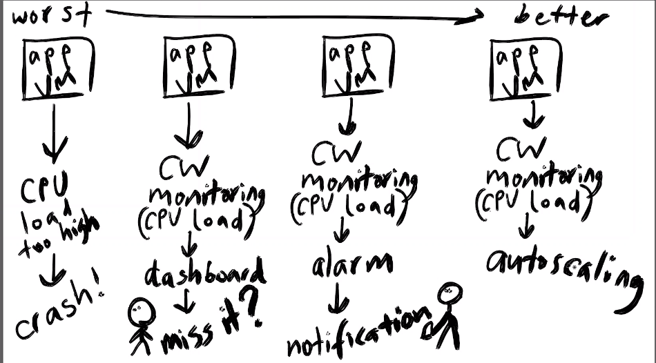
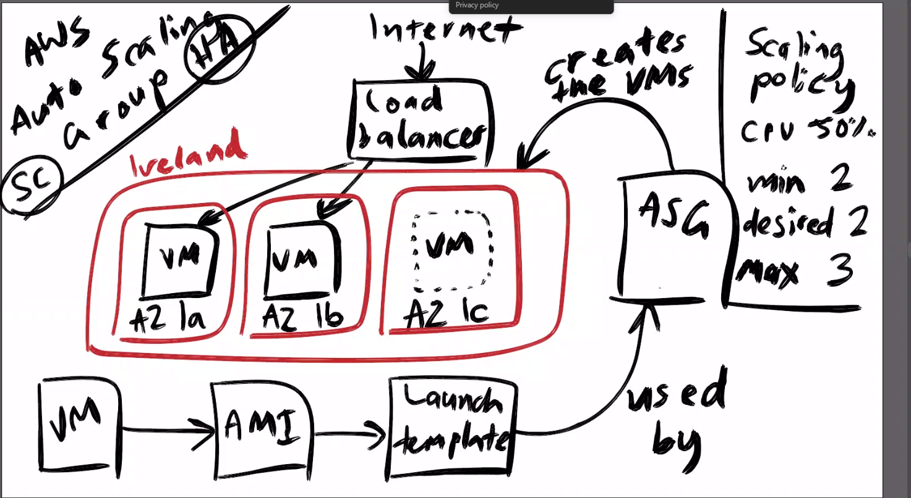

## Autoscaling groups ##

1. when you have a app VM that has too high load it will crash 

2. cloud watch monitoring - cpu load - dashbaord to monitor spike (someone has to manually monitor and might miss it )

3. alarm notification settings - still not good enough 

4. autoscaling - best solution

```
- option 1 
(up and down - more resource, bigger cpu and memory) 
```
```
- option 2
(scale out/in - more instances (VM) being created on demand)
```

# AWS autoscaling group 

`benifits:`
```
scalability 
high availability - instances in different data centres 
```
`process`
```
vm 
-> ami copy to create more VMs 
-> launch template (details for the VM needed to create) 
-> autoscaling group (creates vms in availability zone)
```

# launch template: user data, instance setup, same OS, same dependencies same AMI

# autoscaling:
need to know scaling policy eg threshold for cpu 
minimum of number of instances running 2 (desired) think high availability 
maximum instances can be set (for us 3)

internet facing traffic coming in -> load balancer -> specify availability zones (high availility) eg Region ireland 1a, 1b, 1c


ASG
1. database VM running 
2. create new app vm using provision script 
3. ami
4. launch template using that ami
5. tested launch template 
6. create ASG
7. load balance and test DNS







