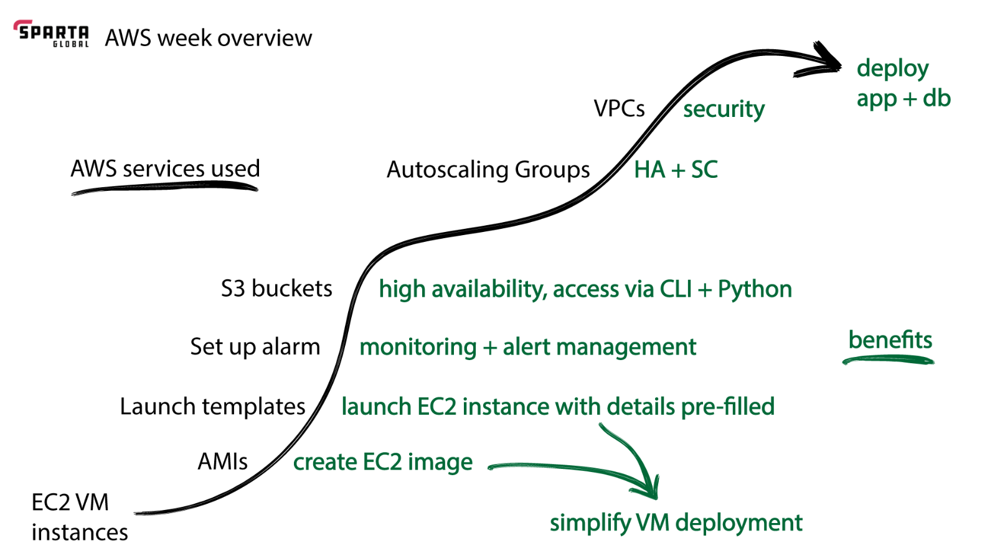

## Git push commands to existing repository 
```
git remote add origin https://github.com/kshrestha94/Tech241-AWS.git
git branch -M main
git push -u origin main
```

### What is DevOps?
```
DevOps is a team that sits between the development and operations teams to enable organizations to deliver high-quality software products efficiently and effectively through collaboration, automation, and continuous improvement.`
```
```
DevOps emphasizes the automation of processes, continuous integration and continuous delivery (CI/CD), infrastructure as code (IaC), and the use of monitoring and feedback loops. It encourages a shift in mindset, promoting collaboration and shared responsibility among developers, operations personnel, and other stakeholders involved in the software delivery lifecycle.

By adopting DevOps practices, organizations can achieve faster software releases, increased deployment frequency, shorter time to market, improved reliability, and enhanced customer satisfaction. It also helps to address challenges such as reducing manual errors, minimizing downtime, and enabling faster recovery from failures.

DevOps is often associated with the use of various tools and technologies, such as version control systems (e.g., Git), configuration management tools (e.g., Ansible, Chef, Puppet), containerization (e.g., Docker, Kubernetes), cloud computing platforms (e.g., Microsoft Azure, Amazon Web Services), and monitoring and analytics tools (e.g., Prometheus, ELK stack).

# Sharuks Article
```

```
### what is AWS?
```
AWS stands for Amazon Web Services. It is a comprehensive cloud computing platform provided by Amazon. AWS offers a wide range of cloud services and solutions, including computing power, storage, databases, networking, analytics, machine learning, artificial intelligence, Internet of Things (IoT), security, and more.
```
### Difference between AWS and Azure cloud computing?

`Providers:` Azure is provided by Microsoft, while AWS is provided by Amazon.

`Market Share:` AWS has been in the market longer and currently holds a larger market share, while Azure has been steadily gaining popularity and is the second-largest cloud provider.

`Service Offerings:` Both Azure and AWS offer a wide range of cloud services and solutions, including computing, storage, databases, networking, machine learning, and more. However, the specific services and features may differ between the two platforms.

`Global Infrastructure:` Both Azure and AWS have a global presence with data centers located in multiple regions worldwide. However, AWS has a larger number of regions and availability zones compared to Azure.

`Pricing Models:` Azure and AWS have different pricing models and cost structures. It's important to review the pricing details of each service to understand the cost implications based on your specific requirements.

`Integration with Other Tools and Services:` Azure integrates well with other Microsoft tools and services, such as Windows Server, Active Directory, and Visual Studio. AWS has extensive integrations with various services and tools, both from Amazon and third-party providers.

`Popularity in Different Industries:` Azure is often chosen by organizations with existing investments in Microsoft technologies, as it provides seamless integration with their existing infrastructure and services. AWS has been popular across various industries, including startups, enterprise companies, and technology companies.

### AWS - week overview



### Example of a Good Repo
- images that backup
- consise points

### AWS overview
```
EC2 VM instances - Virtual Machines on AWS
AMI - creating EC2 images - dont have a equivalent on azure
Launch templates 
setup alarms - monitor and notifications 
s3 buckets - like blob storage, cli interface and python 
```
### Advances topics # 
```
autoscaling groups 
Virtual Private Clouds VPCs - reinforced security
Deployment of application and scripts 
```
### T1 - Differnces between AWS and Azure 

`resource groups` - in azure everything must go in a resource group, in AWS nothing is needed to go in a resource group.

`IP addresses` - azure defualt uses static - same ip
in aws - uses dynamic - changes everytime you restart your vm

`Terminology differences` 
- Launce vs create VM on AWS


### Launching our First EC2 instances 

`**security of AWS, NOT to lead credentials**` 

security measures  
keypass - software 
password in personal cloud drive
key vaults in azure and aws 

AWS login 
region locations - always select Ireland EU-west 1

creating a EC2 VM
EC2 instances - how many VM are running
Creating a SSH Key - for AWS we are using one Ramon created 


## Key pair EC2

pair type RSA - has two files and will give you private key
private key file format  - .pem file 
create 
download .pem file ( for private key)


## launch EC2

`Name and Tags - tech241-kevin-app`


`image -stay away from minimal (18.04 lts 1e9)`


```
insure you select community AMI, filter Ubuntu and search 18.04 lts 1e9
```

`instance type t2.micro`

`key pair - tech 241`

network is set to default 
auto pubic IP
firewall - who can access 

`create security group once then use existing security` 


```
For first time instances creating security group and for all other instances use existing and search for sg previously created. this should allow SSH, HTTP and inbound port 3000
```

`creating sg first time` 
```
group
allow SSH traffice from - anywhere 
edit add inbound port 3000
sg -tech241-kevin-app-sg-SSH-HTTP-3000
custom tcp - port 3000 - source type from anywhere - (description sparta app)
```

`config storage - default`
`adv details - NA`
`launch`


# connecting to EC2 VM

`connect tab`

`cd .ssh`

`chmod 400 < insert.pem file >` - This will allow read access to user and no access to groups and others. Note when you run ls -l command it will still show group and other have read only permissions because the OS you are running is not complete Linux.

`copy public DNS on notepad and add ~/.ssh/` - AWS is has a dynamic IP addess so it will always change when intancing into your VM.

# terminating your EC2 VM

search for your VM on instances through filtering your name. 

`click instance state and terminate instance` - Note you can terminate your VM without stopping and do not to delete additonal resource groups etc like in azure

# Task 1.2: Automation L3.5 - Setup Sparta test app (with working posts page) on AWS using scripts (from Azure)
```
create the database VM - use tech241-<yourname>-db-sg-SSH-mongo (or similar) for your security group name.
```
`remember to add inbound port 27017`

`create a script provision file using command touch`

`nano into your provisions.sh file and add script`

`use chmod u+x provision.sh to give user execute permissions`
```
run your database script
```
`run script`
```
check the database script did it's job
```
```
create the app VM
```
`on the vm script make sure to change your IP address to your db vm each time as AWS has dynamic IP`
```
run your app script (with working reverse proxy) add command 
```
`sudo sed -i 's#try_files $uri $uri/ =404;#proxy_pass http://localhost:3000;#g' /etc/nginx/sites-available/defaul`

`sudo systemctl restart nginx`
```
check the app script did it's job
```


