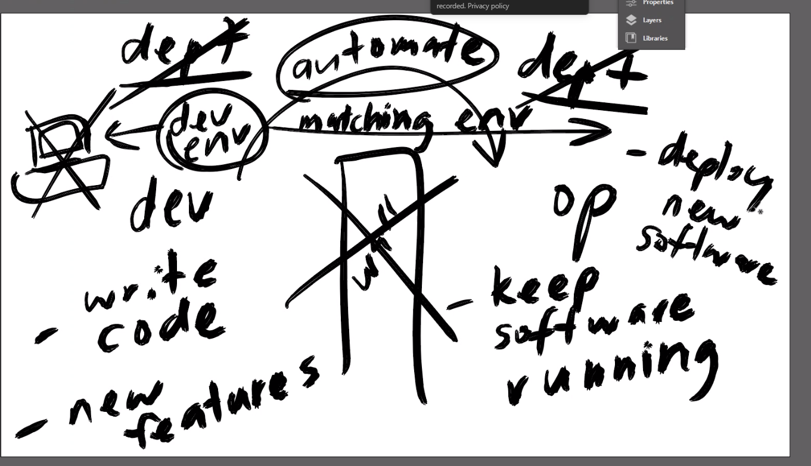

# What is DevOps 2.0

`Devops` 
```
The automation of releasing a working software (to get MVP to end user)
```
```
sits between development and operations team promoting collaboration`
```
```
improvement from waterfall anology - having a solid documentation that could not be changed, having completed one block before moving to the next.
```
```
A seamless deployment of application for businesses  
```
```
Agile mindset where scripts are updated with buiness needs (versions) to keep up with technology and competitors creating flexibility` 
```
# DevOps Pipeline

```
plan - sprints, user stories, documentation, trello
```
```
code - version control, GITBASH
```
```
build - automation provision script
```
```
test - quality control
```
```
release - GITHUB
```
```
deploy - azure AWS
```
```
operate - anisble, kubernetes
```
```
monitor - virtualisation
```

`Using CI/CD pipleline to monitor and feedback.` 

`Faster release of software, increased delopment frequency, enhances business value continuously; reduce bugs, downtime and enbales faster recovery from failures.`

`There is not value to business with just code. needs a working software`


# Devs                                     

- write code
- new features


|||||||||||||||||||||||||||||||||||  devops to automate process- ||||||||||||||||||||||||||||||||||||||||| 

# Operations 

- keep software, servers running, deploy new sofware version and keep 

```
1. when new version is created, it is pushed over to operations, creating conflict devs are creating codes that dont work in the environment for operations 

2. in one team you have a dev an devops and ops. example of collaborartion. 

3. Devops sets up a dev environment that works on operations environment for delopment to reduce bugs etc 
```




# script  DB VM

#!/bin/bash

There are different shells, we use bash and it has certain commands. when we SSH it runs a bash session 

#! - command that runs a sub shell to run bash script 

# update
sudo apt update -y

# upgrade
sudo apt upgrade -y

# download key for the right version of MONGODB
wget -qO - https://www.mongodb.org/static/pgp/server-3.2.asc | sudo apt-key add -

# source list - specify mongo db version
echo "deb http://repo.mongodb.org/apt/ubuntu xenial/mongodb-org/3.2 multiverse" | sudo tee /etc/apt/sources.list.d/mongodb-org-3.2.list

# update again
sudo apt update -y

# install mongo db
sudo apt-get install -y mongodb-org=3.2.20 mongodb-org-server=3.2.20 mongodb-org-shell=3.2.20 mongodb-org-mongos=3.2.20 mongodb-org-tools=3.2.20

# configure bindip to 0.0.0.0
sudo sed -i 's/bindIp: 127.0.0.1/bindIp: 0.0.0.0/g' /etc/mongod.conf

# start mongo db - for changes in configure to start. if nginx 
sudo systemctl restart mongod

# check the status
sudo systemctl status mongod

# enable mongo db - starts on machine reboot and enable only works on system processes. wont work for node.js 
sudo systemctl enable mongod

############################################### vm

#!/bin/bash

# update
sudo apt update -y

# upgrade
sudo apt upgrade -y

# install nginx - when installed it starts autometically
sudo apt install nginx -y

# restart nginx   
sudo systemctl restart nginx


# enable nginx - makes sure that when vm is restarted, ngix auto start on reboot
sudo systemctl enable nginx

# incase sed is not installed in imagine being used
sudo apt install sed -y

# reverse proxy, redirection to proxy
sudo sed -i 's#try_files $uri $uri/ =404;#proxy_pass http://localhost:3000;#g' /etc/nginx/sites-available/default

# restart to change config can take place 
sudo systemctl restart nginx


# get the right version of node js from url
curl -sL https://deb.nodesource.com/setup_12.x | sudo -E bash -

# install nodejs
sudo apt install nodejs -y

# node package manager helps app run from background 
sudo npm install pm2 -g

# copy app folder to VM into home directory in folder app
git clone https://github.com/jungjinggg/tech241_sparta_app.git app


# set env variable for the app to look up data from # when using private ip adress it will be static 
export DB_HOST=mongodb://< insert IP address of DB VM>:27017/posts

# go into the app folder
cd /home/adminuser/app/app

# install npm before starting; it checks all environment variables; downloads required dependencies for node.js
npm install

# run sparta node app in the background
pm2 start app.js


################################################################################################################

scenario 1 - loggin/SSH in as ubuntu + running app script

pwd - you will be home directory for ubuntu
/home/ubuntu

git clone... 

/home/ubuntu/repo
cd repo/app


scenario 2 - get VM to run app script for us (as root user)

pwd - will go to root directory 
/

git clone... repo
/repo

cd repo/app - relative path will work for root 


Vnet -
subnets - default and db

app vm and db vm

NSG(allows 27017 for coming in from outside using public IP) - NIC(public IP outside the house; private accesses between NIC of the VMs(internal comms)) and subnet 


AMI - amazon machine image
snapshot of the disk; making a copy to recreate a virtual machine 

# Creating DB instance VM using user data for automation 
```
create DB Vm name 
```
```
select the correct image. 
```
```
use existing security key of previous db vm 
```
# advance details creating db VM
```
user data is root and created only when vm is instanced (so take account of time)

user data will automate and run your script without manually having to run.
```

`on image paste script for db`
```
launch instance and SSH in 
- You must wait to allow script to run before SSH login.
```
```
SSH login
```
# check status of mongod 
```
sudo systemctl status mongod
```

# check congif file that bind ip is 0.0.0.0
```
 cat /etc/mongod.conf
```


# Create AMI for DB VM with user details on overview follow the commands 
   
`Actions`

`create image - image and template`  

```
- image name 
- image description
- tags Name:value 
  
- create image 
```

# Creating new db VM using created AMI image.
```
create new instance
image defaults to AMI name 
Security group - db mongod 3000
```
`create`  
```
when SSH login -(change from root to ubuntu)
```

# Why use an AMI? 
```
- this allows us to quickly set up a virtual machine for our data base to automatically run the script

- costs less because only used disk storage 

```
