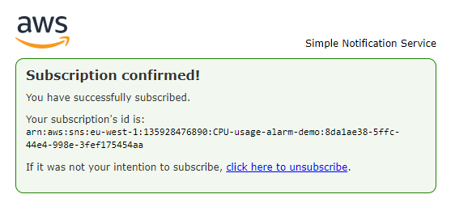

# Task: Cloudwatch monitoring, alert management tasks

## Document how you setup a dashboard


```
creating new dashbaord
```
## Adding to dashboard


```
adding monitor to dashboard
```

## Create a CPU usage alarm for your EC2 instance (app instance) → you get a notification sent your email

view in metrics 
graphed metrics tab and custom refresh interval to 1 minute
action create alarm bell button
select period >= 1minute
conditions - static 
set threshold value eg. `> 0.3`
Next

create new topic 
topic name - demo alarm
email - insert email
create topic



```
subscription confirmation
```

next 
alarm name 
next 
review and create 


## Document CPU usage alarm - try to include a screenshot of the email.

click on your alarm


```
The screenshot above shows the cpu utalization graph for my application VM. The graph shows the spike above the desired threshold of > 0.3. This will send a cloudwatch alarm straight to my email.
```


